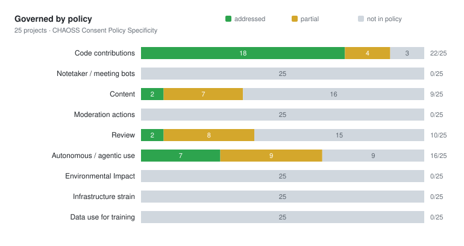
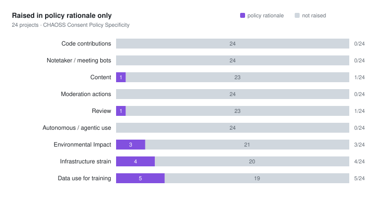

# AI policy coverage summary of all (currently 38) projects

The taxonomy below maps to the CHAOSS AI specificity [metric found here](https://github.com/chaoss/wg-ai-alignment/blob/main/metrics/ai-alignment-community-governed-use/ai-use-consent-policy-specificity.md#taxonomy-of-domains).

🟥 **1** Code contributions · 🟧 **2** Notetaker and meeting bots · 🟨 **3** Content and documentation · 🟩 **4** Moderation and enforcement · 🟦 **5** Review of contributions · 🟪 **6** Autonomous and agentic use · 🟫 **7** Environmental impact · ⬛ **8** Infrastructure strain · ⬜ **9** Data use for training

`X` addressed · `~` partial · `R` raised in the policy's rationale but not governed · blank not mentioned

| Project | 🟥 1 | 🟧 2 | 🟨 3 | 🟩 4 | 🟦 5 | 🟪 6 | 🟫 7 | ⬛ 8 | ⬜ 9 | |
|---|:-:|:-:|:-:|:-:|:-:|:-:|:-:|:-:|:-:|---|
| afnix | ~ |  |  |  |  |  |  |  |  | [view report][p1] |
| apache | X |  | X |  |  | ~ |  |  |  | [view report][p2] |
| astropy/astropy-project | X |  | ~ |  |  | X |  |  |  | [view report][p3] |
| castle-game-engine | X |  | ~ |  | X | X |  |  |  | [view report][p4] |
| codeberg | ~ |  |  | ~ |  | ~ | R | ~ | X | [view report][p5] |
| debian | ~ |  | ~ | ~ | R | X | R | R |  | [view report][p6] |
| forgejo | X |  | X |  | ~ | X |  |  |  | [view report][p7] |
| gcc | X |  |  |  | ~ | ~ |  |  |  | [view report][p8] |
| gdal-site | X |  |  |  | R | ~ |  |  |  | [view report][p9] |
| gentoo | ~ |  |  |  |  |  | R |  |  | [view report][p10] |
| ghostty-org/ghostty | ~ |  | ~ | ~ |  |  |  |  |  | [view report][p11] |
| go-gitea/gitea | X |  |  | ~ |  |  |  |  |  | [view report][p12] |
| jazzband/pip-tools | X |  |  | ~ |  | ~ |  |  |  | [view report][p13] |
| jellyfin/jellyfin.org | X |  |  | ~ |  | X |  |  |  | [view report][p14] |
| kde-gsoc | ~ |  |  |  |  |  | R |  |  | [view report][p15] |
| keepassxreboot/keepassxc | ~ |  |  |  |  |  |  |  |  | [view report][p16] |
| linux-foundation | X |  | ~ |  | R |  |  |  | R | [view report][p17] |
| llvm/llvm-project | X |  | X | ~ | ~ | ~ |  |  |  | [view report][p18] |
| mastodon/.github | X |  | ~ |  | X | X |  |  |  | [view report][p19] |
| matplotlib/matplotlib | X |  |  | ~ |  | ~ |  |  |  | [view report][p20] |
| nlnet-labs | X |  | ~ |  | X |  |  |  |  | [view report][p21] |
| openinfra | X |  | ~ |  |  | ~ |  |  |  | [view report][p22] |
| OSGeo/gdal | X |  |  | ~ | R | X |  | R |  | [view report][p23] |
| OSGeo/PROJ | X |  | ~ | ~ | ~ | ~ |  |  |  | [view report][p24] |
| oxide | X |  | X |  | ~ |  |  |  | ~ | [view report][p25] |
| pola-rs/polars | ~ |  | ~ |  | ~ | ~ |  |  |  | [view report][p26] |
| postmarketos | ~ |  |  |  |  |  | R | R |  | [view report][p27] |
| python-attrs/attrs | ~ |  |  |  |  |  |  |  |  | [view report][p28] |
| qemu/qemu | X |  |  |  |  |  |  |  |  | [view report][p29] |
| qgis/QGIS-Enhancement-Proposals | X |  | X | ~ | ~ | ~ |  | R |  | [view report][p30] |
| rust-lang/rust-forge | X |  | X |  | X |  | R |  |  | [view report][p31] |
| scikit-learn/scikit-learn | ~ |  |  | ~ | ~ |  |  |  |  | [view report][p32] |
| servo/book | X |  | ~ | ~ | ~ |  | R |  |  | [view report][p33] |
| sunpy/sunpy | ~ |  | ~ |  |  |  |  |  |  | [view report][p34] |
| teamtype/teamtype | ~ |  | ~ |  |  |  |  |  |  | [view report][p35] |
| torvalds/linux | X |  |  |  |  | X |  |  |  | [view report][p36] |
| yt-dlp/yt-dlp | ~ |  |  |  | ~ | ~ |  |  |  | [view report][p37] |
| zulip/zulip | X |  |  |  |  |  |  |  |  | [view report][p38] |

[p1]: afnix/2026-08-30.md
[p2]: apache/2026-08-30.md
[p3]: astropy-astropy-project/2026-08-30.md
[p4]: castle-game-engine/2026-08-30.md
[p5]: codeberg/2026-08-30.md
[p6]: debian/2026-08-30.md
[p7]: forgejo/2026-08-30.md
[p8]: gcc/2026-08-30.md
[p9]: gdal-site/2026-08-30.md
[p10]: gentoo/2026-08-30.md
[p11]: ghostty-org-ghostty/2026-08-30.md
[p12]: go-gitea-gitea/2026-08-30.md
[p13]: jazzband-pip-tools/2026-08-30.md
[p14]: jellyfin-jellyfin-org/2026-08-30.md
[p15]: kde-gsoc/2026-08-30.md
[p16]: keepassxreboot-keepassxc/2026-08-30.md
[p17]: linux-foundation/2026-08-30.md
[p18]: llvm-llvm-project/2026-08-30.md
[p19]: mastodon-github/2026-08-30.md
[p20]: matplotlib-matplotlib/2026-08-30.md
[p21]: nlnet-labs/2026-08-30.md
[p22]: openinfra/2026-08-30.md
[p23]: osgeo-gdal/2026-08-30.md
[p24]: osgeo-proj/2026-08-30.md
[p25]: oxide/2026-08-30.md
[p26]: pola-rs-polars/2026-08-30.md
[p27]: postmarketos/2026-08-30.md
[p28]: python-attrs-attrs/2026-08-30.md
[p29]: qemu-qemu/2026-08-30.md
[p30]: qgis-qgis-enhancement-proposals/2026-08-30.md
[p31]: rust-lang-rust-forge/2026-08-30.md
[p32]: scikit-learn-scikit-learn/2026-08-30.md
[p33]: servo-book/2026-08-30.md
[p34]: sunpy-sunpy/2026-08-30.md
[p35]: teamtype-teamtype/2026-08-30.md
[p36]: torvalds-linux/2026-08-30.md
[p37]: yt-dlp-yt-dlp/2026-08-30.md
[p38]: zulip-zulip/2026-08-30.md

## Included in Policy

Bar chart of metric taxonomy captured in policy documents.

'partial' means the terminology used **leans** towards a given outcome, but might be more or less specific. Worth capturing these, to see how language changes over time.

### What the rules say

Up to three examples per domain, from the projects that govern it.

**Code contributions** (24 addressed, 14 partial, of 38)

- [OSGeo/PROJ](osgeo-proj/2026-08-30.md) `human_in_the_loop`
  > there must be a **human in the loop**. Contributors must read and review all AI ... generated code or text before they ask other project members to review it.
- [OSGeo/gdal](osgeo-gdal/2026-08-30.md) `human_in_the_loop`
  > Human contributors must be the primary author(s) of GDAL contributions
- [afnix](afnix/2026-08-30.md) `banned` partial
  > AFNix hosted projects do not allow any contributions which are believed to include AI generated content, or to be derived from AI generated content.
- [codeberg](codeberg/2026-08-30.md) partial
  > Projects written and maintained with heavy use of LLMs

**Notetaker and meeting bots**: no project addresses this.

**Content and documentation** (6 addressed, 13 partial, of 38)

- [apache](apache/2026-08-30.md) `disclosure_required`
  > The above text applies to documentation as well.
- [forgejo](forgejo/2026-08-30.md) `banned`
  > Forgejo does not accept works of authorship (code, documentation, etc.) either partially or completely generated by AI due to legal uncertainties.
- [OSGeo/PROJ](osgeo-proj/2026-08-30.md) `human_in_the_loop` partial
  > using an LLM to generate documentation, which a contributor manually reviews for correctness and relevance, edits, and then posts as a PR, is an approved use of tools under this policy.
- [astropy/astropy-project](astropy-astropy-project/2026-08-30.md) partial
  > In the context of Generative AI, this particularly means conveying information (comments, documentation, etc) in a style the Astropy community uses, and that is appropriate and to the point.

**Moderation and enforcement** (13 partial, of 38)

- [OSGeo/PROJ](osgeo-proj/2026-08-30.md) `banned` partial
  > maintainers may lock the conversation and/or close the pull request/issue/RFC. In case of repeated violations of our policy, the PROJ project reserves itself the right to ban temporarily or...
- [OSGeo/gdal](osgeo-gdal/2026-08-30.md) partial
  > maintainers may lock the conversation and/or close the pull request/issue/RFC
- [codeberg](codeberg/2026-08-30.md) `human_in_the_loop` partial
  > Our moderation team will not start off generating an exhaustive list of affected repositories to remove.

**Review of contributions** (4 addressed, 10 partial, of 38)

- [castle-game-engine](castle-game-engine/2026-08-30.md) `human_in_the_loop`
  > Use AI for code reviews. It’s useful to have another set of eyes look at your code changes.
- [mastodon/.github](mastodon-github/2026-08-30.md) `banned`
  > Copy-and-pasting to and from an AI chatbot during the process of code review is not acceptable (unless this is only for translation to and from English).
- [OSGeo/PROJ](osgeo-proj/2026-08-30.md) `human_in_the_loop` partial
  > automated review tools that publish comments without human review are not allowed. However, an opt-in review tool that **keeps a human in the loop** is acceptable under this policy.
- [forgejo](forgejo/2026-08-30.md) `banned` partial
  > Using general AI for review is forbidden. If the change contains changes to the UX it has to be approved by a human reviewer.

**Autonomous and agentic use** (8 addressed, 12 partial, of 38)

- [OSGeo/gdal](osgeo-gdal/2026-08-30.md) `banned`
  > Human-coordinated or uncoordinated (OpenClaw, etc) use of agents for submission of contributions to the GDAL repository is *banned*.
- [astropy/astropy-project](astropy-astropy-project/2026-08-30.md) `banned`
  > Autonomous workflows ("agents") are not human contributors. Astropy reviewers expect to interact with the human controlling the account, or we will close the PR.
- [OSGeo/PROJ](osgeo-proj/2026-08-30.md) `banned` partial
  > An important implication of this policy is that it bans agents that take action in our digital spaces without human approval, such as the GitHub `@claude` agent.
- [apache](apache/2026-08-30.md) `disclosure_required` partial
  > If no one reviews it, for example a bot posting announcements or replies directly, the published text must state clearly that it was generated by AI.

**Environmental impact**: no project addresses this.

**Infrastructure strain** (1 partial, of 38)

- [codeberg](codeberg/2026-08-30.md) partial
  > Projects where the amount of resources (e.g. storage, CI/CD) is significantly larger than what the involved amount of people could have created by hand

**Data use for training** (1 addressed, 1 partial, of 38)

- [codeberg](codeberg/2026-08-30.md) `banned`
  > The Codeberg forge and its associated services are not and will not use the code or data of projects and users to train "Artificial Intelligence" tools such as Large Language Models
- [oxide](oxide/2026-08-30.md) `human_in_the_loop` partial
  > when uploading a document to a hosted LLM (ChatGPT, Claude, Gemini, etc.), there must be assurance of data privacy—and specifically, assurance that the model will not use the document to train...

## Included in Rationale

Bar chart of metric taxonomy captured in accompanying blog posts, or preamble to policy.

Sometimes the *reason* for a policy will include one of our metric taxonomies (like environment) but not be specifically mentioned in the policy itself. Seems worth capturing.

### Review of contributions

- [OSGeo/gdal](osgeo-gdal/2026-08-30.md)
  > It is the time to review your contribution ... Indiscriminate usage of LLMs in open source projects *consume* maintenance
- [debian](debian/2026-08-30.md)
  > New contributors submitting LLM output for review places an unnecessary strain on the reviewer, which can lead to burnout.
- [gdal-site](gdal-site/2026-08-30.md)
  > The document notes that maintenance -- including 'the time to review your contribution' -- is the constrained resource LLM use consumes, but this is offered as rationale for limiting...
- [linux-foundation](linux-foundation/2026-08-30.md)
  > Development and review of code generated by AI tools should be treated no differently.

### Environmental impact

- [codeberg](codeberg/2026-08-30.md)
  > Due to the energy and water demands that are inherent to the data centers built specifically for training LLMs, many communities already today experience rising consumer costs for both electricity...
- [debian](debian/2026-08-30.md)
  > LLM training consumes a staggering amount of resources... LLM usage accelerates the destruction of our ecosystem (planet earth) and that is a deal-breaker
- [gentoo](gentoo/2026-08-30.md)
  > Their operations are causing concerns about the huge use of energy and water.
- [kde-gsoc](kde-gsoc/2026-08-30.md)
  > KDE cares about licensing, ethics and environment, which are three things that AI does not care about.
- [postmarketos](postmarketos/2026-08-30.md)
  > They require an unreasonable amount of energy[1] and water[2] to build and operate
- [rust-lang/rust-forge](rust-lang-rust-forge/2026-08-30.md)
  > many others feel that its negative impact on society and the climate are severe enough that no use is acceptable
- [servo/book](servo-book/2026-08-30.md)
  > AI tools require an unreasonable amount of energy and water to build and operate, their models are built with heavily exploited workers in unacceptable working conditions, and they are being used...

### Infrastructure strain

- [OSGeo/gdal](osgeo-gdal/2026-08-30.md)
  > The GDAL sponsorship program is one way your organization can help buffer the cost and disruption of LLMs in keystone projects such as GDAL
- [debian](debian/2026-08-30.md)
  > This has had a major negative impact on Debian's public web resources, effectively a large scale and perpetual Denial of Service attack on sites that many users rely on... wastes system...
- [postmarketos](postmarketos/2026-08-30.md)
  > oftentimes causing DDoS attacks against FOSS infrastructure in the process (which in turn force the deployment of challenge-based protections and increase cost and complexity of self-hosting for...
- [qgis/QGIS-Enhancement-Proposals](qgis-qgis-enhancement-proposals/2026-08-30.md)
  > it takes a lot of maintainer time and energy to review those contributions

### Data use for training

- [linux-foundation](linux-foundation/2026-08-30.md)
  > some tools provide a feature that flags similarity between copyrighted training data or other materials owned by third parties and the AI tool's output

